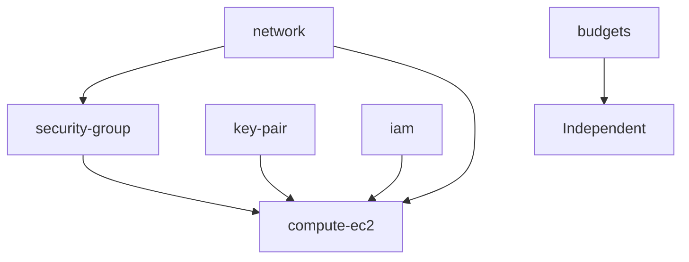

# Terraform Modules Reference

## 📦 Module Overview

The NAAS Production Infrastructure uses modular Terraform design for reusability and maintainability.

## 🏗️ Module Architecture

```
modules/
├── network/           # VPC and networking components
├── security-group/    # Security group rules
├── key-pair/         # SSH key pair generation
├── iam/              # IAM roles and policies
├── compute-ec2/      # EC2 instances and user data
└── budgets/          # Cost monitoring and alerts
```

## 📋 Module Index

| Module | Purpose | Resources Created |
|--------|---------|-------------------|
| [network](network.md) | VPC and subnets | VPC, Subnets, IGW, Route Tables |
| [security-group](security-group.md) | Network security | Security Groups, Rules |
| [key-pair](key-pair.md) | SSH access | TLS private key, AWS key pair |
| [iam](iam.md) | Access management | IAM roles, policies, instance profiles |
| [compute-ec2](compute-ec2.md) | Virtual machines | EC2 instances, EBS volumes |
| [budgets](budgets.md) | Cost control | Budget, alerts, notifications |

## 🔄 Module Dependencies



## 🎯 Module Design Principles

### Reusability
- Environment-agnostic modules
- Configurable through variables
- No hardcoded values

### Maintainability
- Single responsibility per module
- Clear input/output interfaces
- Comprehensive documentation

### Security
- Least privilege IAM policies
- Encrypted resources by default
- Security group restrictions

## 🔧 Module Usage Patterns

### Basic Usage
```hcl
module "network" {
  source = "../../modules/network"
  
  vpc_cidr           = var.vpc_cidr
  availability_zones = var.availability_zones
  environment        = var.environment
  project_name       = var.project_name
  
  tags = local.common_tags
}
```

### Module Composition
```hcl
# Network foundation
module "network" { ... }

# Security layer
module "security_group" {
  vpc_id = module.network.vpc_id
  ...
}

# Compute layer
module "compute_ec2" {
  vpc_id            = module.network.vpc_id
  public_subnet_ids = module.network.public_subnet_ids
  security_group_ids = [module.security_group.kubernetes_sg_id]
  ...
}
```

## 📊 Module Inputs/Outputs

### Common Input Variables
| Variable | Type | Description | Required |
|----------|------|-------------|----------|
| `environment` | string | Environment name | Yes |
| `project_name` | string | Project identifier | Yes |
| `tags` | map(string) | Resource tags | Yes |

### Common Output Values
| Output | Type | Description |
|--------|------|-------------|
| `*_id` | string | Resource identifier |
| `*_arn` | string | Resource ARN |
| `*_name` | string | Resource name |

## 🔒 Security Considerations

### IAM Module
- Minimal required permissions
- Instance profiles for EC2
- No hardcoded credentials

### Security Group Module
- Restrictive default rules
- Port-specific access
- Source IP restrictions

### Compute Module
- Encrypted EBS volumes
- Security group associations
- Key-based authentication

## 🚀 Extending Modules

### Adding New Resources
1. Update module variables
2. Add resource definitions
3. Update outputs
4. Test in isolation

### Creating New Modules
1. Follow naming conventions
2. Include variables.tf, main.tf, outputs.tf
3. Add comprehensive documentation
4. Test with multiple environments

## 🧪 Module Testing

### Validation
```bash
# Validate syntax
terraform validate

# Check formatting
terraform fmt -check

# Plan without apply
terraform plan
```

### Integration Testing
```bash
# Deploy to test environment
cd infrastructure/live/test
terraform init
terraform apply

# Verify resources
terraform show
```

## 📚 Module Documentation

Each module includes:
- **README.md**: Overview and usage
- **variables.tf**: Input documentation
- **outputs.tf**: Output documentation
- **examples/**: Usage examples

## 🔄 Module Versioning

### Current Approach
- Modules stored in same repository
- Version controlled with main project
- Changes affect all environments

### Future Considerations
- Separate module repository
- Semantic versioning
- Module registry usage

## 🛠️ Module Development

### Best Practices
1. **Single Responsibility**: One module, one purpose
2. **Clear Interfaces**: Well-defined inputs/outputs
3. **Documentation**: Comprehensive README files
4. **Testing**: Validate in multiple scenarios
5. **Consistency**: Follow project conventions

### Code Standards
```hcl
# Variable naming
variable "instance_type" {
  description = "EC2 instance type"
  type        = string
  default     = "t3.medium"
}

# Resource naming
resource "aws_instance" "master" {
  # Use consistent naming patterns
  tags = merge(var.tags, {
    Name = "${var.project_name}-${var.environment}-master"
  })
}

# Output naming
output "instance_id" {
  description = "EC2 instance identifier"
  value       = aws_instance.master.id
}
```